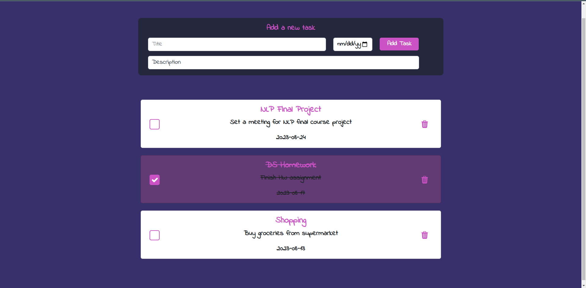
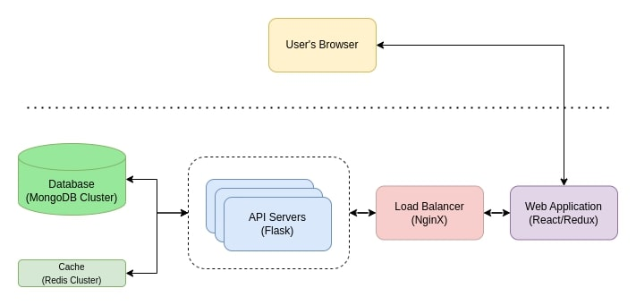
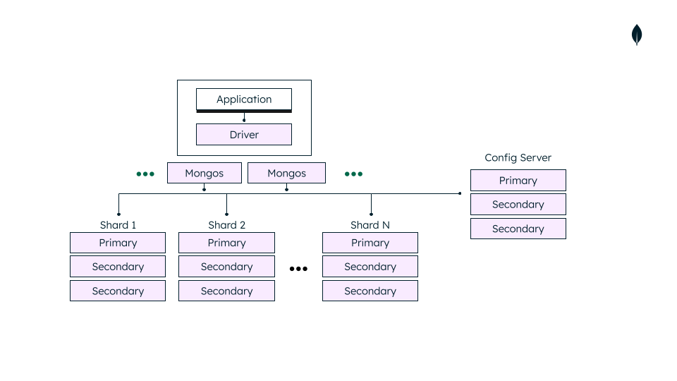
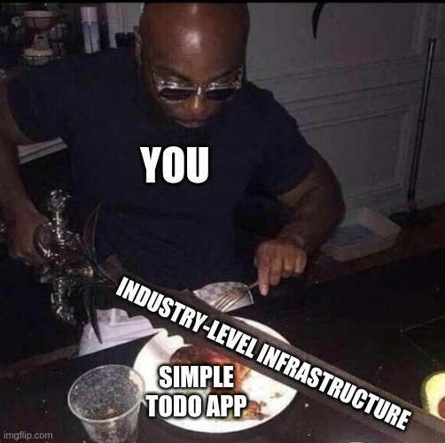

# Distributed ToDo Application

A Distributed To Do List Web Application developed using Flask, React and MongoDB/Redis, with an NGINX load balancer. Deployment on GCP (Google Cloud Platform) VM instances using Terraform and Ansible.


## Architecture

The application is built using a microservices architecture, with each service responsible for a specific functionality. The key-value store will be implemented using [MongoDB](https://www.mongodb.com/), a distributed NoSQL database that is highly scalable and provides excellent performance for our purposed.
The app will communicate with the MongoDB cluster via a RESTful API, which will provide methods for adding, updating, and retrieving to-do items. The app will also include a caching layer, using [Redis](https://redis.io/), to improve performance by reducing the number of requests to the MongoDB cluster.

A general overview of the architecture is depicted below:


Details of the architecture are as follows:

- **User Interface Layer:** The user interface layer is responsible for displaying the to-do list and allowing users to interact with the app. This layer is a web-based application and uses technologies such as HTML, CSS, JavaScript, React, and Redux.
- **API Layer:** The API servers provide the API layer of the to-do app, processing requests from the web server and returning responses. They could be deployed on multiple virtual machines or containers to provide horizontal scaling and high availability. This layer will be implemented using Flask.
- **Caching Layer:** The caching layer is responsible for improving performance by reducing the number of requests to the database layer. This layer uses a caching technology, which is Redis in our case, to store frequently-used data in memory, which can be retrieved quickly.
- **Database Layer:** The database layer is responsible for storing and retrieving the to-do items. The database layer uses a distributed key-value store, MongoDB, which is designed to handle a large amount of data and a high volume of requests.
- **Load Balancer:** The load balancer distributes incoming API requests to the API servers, using a load balancing algorithm to ensure that the load is evenly distributed across the API servers. Nginx will be used as the load balancer for this purpose.
- **Deployment Layer:** The deployment layer is responsible for deploying and managing the components of the app on a cloud platform (i.e, Google Cloud Platform). This layer also monitors the performance and availability of the app and ensures that it remains highly available and scalable.

Additionally, the mongodb cluster consists of 15 different nodes including data shards, config servers and mongos instances. For more information, refer to official [mongodb docs](https://www.mongodb.com/docs/manual/core/sharded-cluster-components/)


## Deployment

### Terraform

First, make sure you have [Terraform](https://www.terraform.io/) and [Ansible](https://www.ansible.com/) installed on your system. You also need to install and setup [gcloud CLI](https://cloud.google.com/sdk/gcloud) with your credentials to deploy the necessary infrastructure on GCP. Additionally, you need to setup a number of secrets on [Google Cloud Secret Manager](https://cloud.google.com/secret-manager). Names for these secrets are identified in [terraform/data-sources.tf](https://github.com/dark-0ne/Distributed-ToDo-App/blob/main/terraform/data-sources.tf).
After cloning the project, go inside terraform directory and run these commands:

```bash
terraform init
terraform apply -var-file="infra.tfvars"
```

This should take care of setting the required infrastructure up on GCP and also create necessary variable files used by services themselves and also Ansible, which is where we are headed next.

### Ansible

For ease of use, there is a bash script in ansible directory which runs all ansible playbooks for the project in the correct order. To run it, just go inside ansible directory and run the script. Be aware that this process takes a long time as there are a number of services needed to be deployed and configured, most notably a MongoDB cluster with 15 nodes with different responsibilities:

```bash
./run-all-playbooks.sh
```

Congratulations, You just deployed a very simple ToDo application on an industry level infrastructure!

